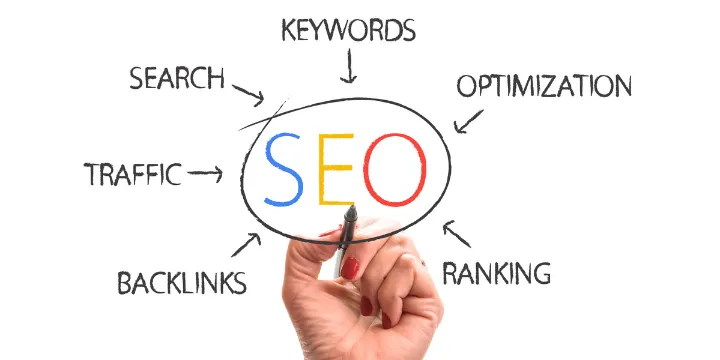
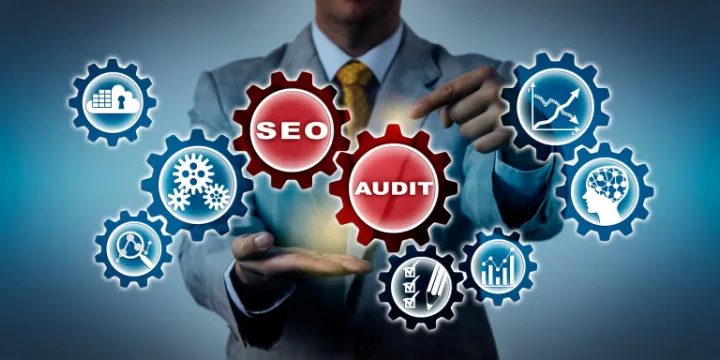

## Introducción a las estrategias de marketing digital para landing pages

En el entorno digital actual, tener una landing page optimizada y eficaz es crucial para el éxito de cualquier campaña de marketing. Una landing page bien diseñada puede convertir visitantes en leads, suscriptores o clientes. Sin embargo, para maximizar su potencial, es fundamental implementar estrategias de marketing digital adecuadas.

*Descripción: Ejemplo de una landing page optimizada para conversiones.*

## Importancia de una estrategia bien definida

Crear una estrategia de marketing digital implica entender a tu audiencia, definir objetivos claros y utilizar las herramientas y técnicas adecuadas para alcanzarlos. Sin una estrategia sólida, las acciones de marketing pueden ser dispersas e ineficaces.

## Promoción en redes sociales

Las redes sociales son plataformas poderosas para dirigir tráfico hacia tu landing page. Publicar contenido atractivo, utilizar anuncios pagados y colaborar con influencers son algunas de las maneras de aprovechar estas plataformas.

*Descripción: Campaña de promoción en redes sociales para una landing page.*

## Optimización SEO para landing pages

El SEO es vital para asegurar que tu landing page aparezca en los resultados de búsqueda relevantes. Esto incluye el uso de palabras clave adecuadas, optimización de imágenes y asegurarse de que la página cargue rápidamente. La integración de técnicas de SEO on-page y off-page puede mejorar significativamente el tráfico orgánico.

*Descripción: Análisis del rendimiento SEO de una landing page.*

## Publicidad paga y campañas de PPC

Las campañas de Pago Por Clic (PPC) pueden generar tráfico inmediato a tu landing page. Plataformas como Google Ads y las redes sociales permiten segmentar audiencias específicas, lo que puede aumentar las conversiones al atraer a visitantes interesados.

## Colaboraciones y marketing de influencers

Colaborar con influencers que compartan una audiencia similar puede aumentar la visibilidad de tu landing page. Los influencers pueden promocionar tu página a través de sus canales, generando tráfico cualificado y aumentando la confianza en tu marca.

*Descripción: Influencers promoviendo una landing page en sus redes sociales.*

## Uso de herramientas analíticas para medir el rendimiento

Utilizar herramientas analíticas como Google Analytics permite monitorear el rendimiento de tu landing page. Analizar métricas como el tiempo en la página, la tasa de conversión y el comportamiento del usuario ayuda a identificar áreas de mejora y a optimizar la página continuamente.

*Descripción: Panel de control de Google Analytics mostrando métricas clave.*

## Mejores prácticas para el diseño de landing pages

Un diseño claro y atractivo, con llamados a la acción (CTA) efectivos, puede aumentar las conversiones. Asegúrate de que el contenido sea relevante y esté alineado con las expectativas del visitante. Pruebas A/B y la optimización continua son claves para un diseño exitoso.

## Conclusión

Promocionar una landing page eficazmente requiere una combinación de estrategias de marketing digital. Desde la optimización SEO y la promoción en redes sociales hasta la colaboración con influencers y el uso de publicidad paga, cada elemento juega un papel crucial. Medir y ajustar continuamente estas estrategias garantiza que tu landing page no solo atraiga tráfico, sino que también convierta visitantes en clientes.

Para obtener más información sobre cómo podemos ayudarte a crear y optimizar tu landing page, visita nuestra [página de servicio de landing page](https://desarrollo-digital.com/servicios/landingpage/).
